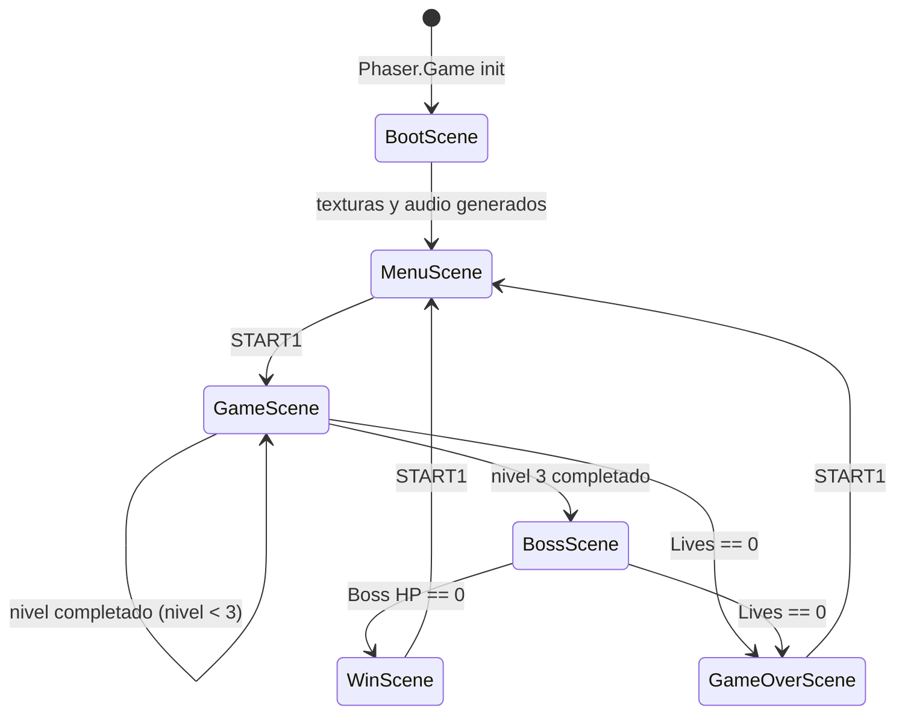
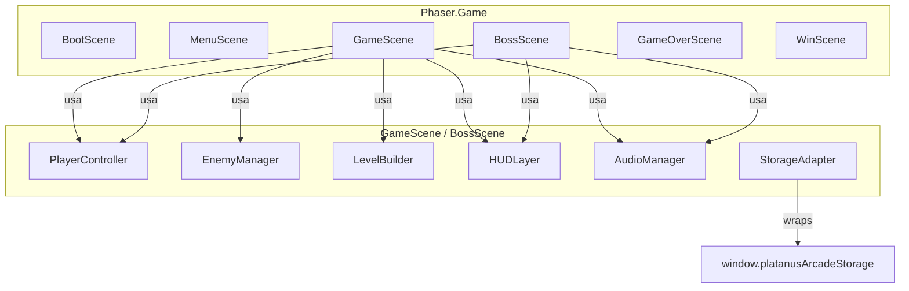
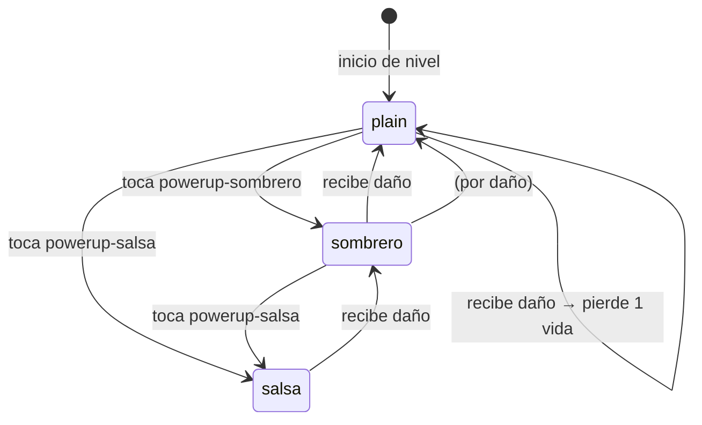

# Design Document — Banana Chilanga

## Overview

Banana Chilanga es un arcade de plataformas de un solo jugador al estilo Mario Bros NES con temática Ciudad de México. El protagonista es una banana que recorre calles, mercado y metro de la CDMX para rescatar a su amada, saltando plataformas, eliminando enemigos con saltos y fireballs, y derrotando al jefe final "El Microbús Maldito".

Todo el código reside en un único archivo `game.js` de ≤ 50 KB minificado. No se usan imágenes externas ni imports: los gráficos se generan proceduralmente con `Phaser.GameObjects.Graphics` y el audio con la Web Audio API interna de Phaser. El juego corre en un lienzo 800 × 600 px con física Arcade.

### Restricciones técnicas clave

| Restricción | Valor |
|---|---|
| Tamaño máx. minificado | 50 KB |
| No imports / no require | ✓ |
| No URLs externas | ✓ |
| No fetch / XHR / WebSocket | ✓ |
| Física | Arcade (gravedad Y = 900 px/s²) |
| Lienzo | 800 × 600 px |
| Ancho mínimo de nivel | 3200 px |

---

## Architecture

### Diagrama de flujo de escenas



### Diagrama de componentes de alto nivel



### Estrategia de escena única vs múltiple

Se usan **escenas separadas** para mantener el código organizado y aprovechar el ciclo de vida de Phaser (`create`/`update`/`shutdown`). El estado global de la partida (score, lives, powerState, highScore, currentLevel) se comparte mediante un objeto singleton `GameState` accesible desde cualquier escena a través del registro de datos de Phaser (`this.registry`).

---

## Components and Interfaces

### BootScene

**Responsabilidad:** Generar todas las texturas y configurar el registro global antes de lanzar MenuScene.

```
class BootScene extends Phaser.Scene {
  constructor()         // key: 'Boot'
  create()              // genera texturas, carga highScore, inicia MenuScene
  _genTextures()        // llama a _genTex() para cada clave
  _genTex(key, w, h, drawFn)  // Graphics → generateTexture → destroy
  _loadHighScore()      // platanusArcadeStorage.get con fallback a 0
}
```

**Texturas generadas:**
`banana`, `banana-sombrero`, `banana-salsa`, `microbus`, `chilango`, `boss`, `powerup-sombrero`, `powerup-salsa`, `coin`, `qblock`, `platform`, `checkpoint`, `fireball`, `particle`, `bg-tiles-1`, `bg-tiles-2`, `bg-tiles-3`, `bg-boss`

### MenuScene

**Responsabilidad:** Mostrar título, HighScore y esperar START1.

```
class MenuScene extends Phaser.Scene {
  constructor()         // key: 'Menu'
  create()              // dibuja título "BANANA CHILANGA", HighScore, instrucción
  update()              // detecta START1 → inicia GameScene nivel 1
}
```

### GameScene

**Responsabilidad:** Lógica principal de juego para niveles 1–3.

```
class GameScene extends Phaser.Scene {
  constructor()                        // key: 'Game'
  init(data)                           // recibe { level: 1|2|3 }
  create()                             // construye nivel, crea player, enemigos, HUD
  update(time, delta)                  // game loop principal
  _buildLevel(level)                   // genera plataformas, enemigos, pickups
  _buildBackground(level)             // Graphics de fondo temático
  _spawnPlayer()                       // crea sprite Banana con física
  _spawnEnemies(level)                 // crea Microbús y Chilango_Enojado
  _spawnPickups(level)                 // monedas, QuestionBlocks, PowerUps
  _spawnCheckpoint(x, y)              // crea Checkpoint
  _handlePlayerInput(delta)           // mueve y salta la Banana
  _handleFireball()                    // dispara/gestiona Fireball
  _onEnemyStomp(player, enemy)        // enemigo pisado
  _onFireballHit(fireball, enemy)     // fireball impacta enemigo
  _onPickupCoin(player, coin)         // recoge moneda
  _onPickupPowerUp(player, pu)        // recoge power-up
  _onBlockHit(player, block)          // cabeza contra QuestionBlock
  _onCheckpointReach(player, cp)      // llega al Checkpoint
  _onPlayerDamage()                    // la Banana recibe daño
  _buildHUD()                          // crea textos Score/Lives/HighScore
  _updateHUD()                         // refresca textos HUD
  _togglePause()                       // pausa / reanuda
  _checkGameOver()                     // transición a GameOverScene
}
```

### BossScene

**Responsabilidad:** Combate contra "El Microbús Maldito".

```
class BossScene extends Phaser.Scene {
  constructor()                        // key: 'Boss'
  create()                             // construye arena, Boss, HUD con barra de vida
  update(time, delta)                  // loop: mueve Boss, dispara proyectiles, input
  _buildArena()                        // fondo caótico tráfico CDMX + plataformas
  _spawnBoss()                         // Microbús 120×80 con cuerpo físico
  _spawnPlayer()                       // reutiliza lógica de GameScene
  _buildHUD()                          // Score, Lives, barra de vida del Boss
  _updateBossHealthBar(hp)             // redibuja barra
  _onBossStomp(player, boss)          // Banana encima del Boss
  _onFireballBossHit(fireball, boss)  // Fireball impacta Boss
  _onBossProjectileHit(player, proj)  // proyectil del Boss impacta Banana
  _bossJumpTimer()                     // timer: salta cada 3 s
  _bossFireTimer()                     // timer: dispara cada 4 s
  _onBossDefeated()                    // animación derrota → WinScene
}
```

### GameOverScene / WinScene

```
class GameOverScene extends Phaser.Scene {
  constructor()   // key: 'GameOver'
  create()        // muestra score, highscore, "Press START"
  update()        // START1 → MenuScene, reinicia GameState
}

class WinScene extends Phaser.Scene {
  constructor()   // key: 'Win'
  create()        // muestra "¡VICTORIA!", score final, highscore
  update()        // START1 → MenuScene, reinicia GameState
}
```

### PlayerController (módulo funcional dentro de GameScene/BossScene)

Encapsula el estado de la Banana. No es una clase Phaser independiente; es un conjunto de funciones que operan sobre el sprite `player` y el objeto `GameState`.

```
// Firmas clave
function createPlayer(scene, x, y)           // → sprite con física configurada
function handleInput(scene, player, keys, delta)
function applyPowerState(scene, player, state)  // ajusta tamaño y accesorios
function takeDamage(scene, player)           // downgrade powerState / pierde vida
function spawnFireball(scene, player)        // crea Fireball si condiciones OK
```

### AudioManager (módulo funcional)

```
// Web Audio API interna de Phaser (sin URLs externas)
function playJump()      // cuadrado 400 Hz, 0.15 s
function playCoin()      // seno 800 Hz, 0.1 s
function playPowerUp()   // triángulo sweeping 600→1000 Hz
function playDamage()    // sierra 150 Hz, 0.3 s
function playKill()      // sierra burst 600→200 Hz
function playFireball()  // seno 300 Hz pulse corto
function playWin()       // arpegio ascendente
function playDefeat()    // sierra descendente
```

### StorageAdapter (módulo funcional)

```
async function loadHighScore()          // → number (0 si falla o inválido)
async function saveHighScore(score)     // key: 'banana-chilanga/highscore'
// Ambas funciones capturan excepciones y no las propagan
```

---

## Data Models

### GameState (objeto singleton en `this.registry`)

```javascript
{
  score: number,          // puntuación acumulada (default 0)
  highScore: number,      // récord histórico (cargado de storage)
  lives: number,          // vidas restantes (default 3)
  level: number,          // nivel actual 1–3 (0 = MenuScene)
  powerState: string,     // 'plain' | 'sombrero' | 'salsa'
  paused: boolean         // estado de pausa
}
```

### PowerState — Máquina de estados de la Banana



**Tabla de transiciones:**

| Estado actual | Evento | Estado siguiente | Efecto adicional |
|---|---|---|---|
| plain | powerup-sombrero | sombrero | tamaño 24×36, sombrero+bigote visibles |
| plain | powerup-salsa | salsa | aura roja visible |
| sombrero | powerup-salsa | salsa | aura roja, sombrero+bigote persisten |
| salsa | daño | sombrero | aura roja desaparece |
| sombrero | daño | plain | sombrero+bigote desaparecen, tamaño 20×30 |
| plain | daño | plain | pierde 1 Life, 2 s invulnerabilidad (parpadeo 8 Hz) |

### Fireball

```javascript
{
  sprite: Phaser.Physics.Arcade.Sprite,  // textura 'fireball'
  velocityX: 300 | -300,                 // px/s, signo según lastDir
  bounceCount: number,                   // 0..3, se destruye tras 3er rebote
  active: boolean
}
```

### Enemy base

```javascript
{
  sprite: Phaser.Physics.Arcade.Sprite,
  type: 'microbus' | 'chilango',
  speed: number,          // 60–120 px/s (Microbús); 100 px/s (Chilango)
  direction: 1 | -1,
  wanderTimer: number,    // solo Chilango: ms hasta próximo cambio de dir
  active: boolean
}
```

### Boss

```javascript
{
  sprite: Phaser.Physics.Arcade.Sprite,  // 'boss', 120×80
  hp: number,             // 1–5
  speed: number,          // 150 (hp>2) | 250 (hp<=2)
  direction: 1 | -1,
  invulTimer: number,     // ms restantes de invulnerabilidad post-impacto
  jumpTimer: number,      // cooldown salto (3000 ms)
  fireTimer: number       // cooldown proyectil (4000 ms)
}
```

### QuestionBlock

```javascript
{
  sprite: Phaser.Physics.Arcade.StaticSprite,  // 'qblock'
  used: boolean,           // false → activo; true → ya golpeado (gris)
  contentType: 'powerup-sombrero' | 'powerup-salsa' | 'coin'
}
```

### Level (configuración declarativa)

```javascript
{
  id: 1 | 2 | 3,
  name: 'Calles' | 'Mercado' | 'Metro',
  width: number,           // >= 3200 px
  bgTheme: 'streets' | 'market' | 'metro',
  platforms: [{x, y, w}], // array de configuraciones de plataforma
  enemies: [{type, x, y}],
  coins: [{x, y}],
  qblocks: [{x, y, content}],
  checkpointX: number
}
```

---

## Error Handling

| Situación | Comportamiento |
|---|---|
| `platanusArcadeStorage` no disponible | `StorageAdapter` devuelve `0` para `.get` y no lanza error en `.set`; el juego sigue sin persistencia |
| `platanusArcadeStorage.get` devuelve valor no numérico / negativo | `highScore` se inicializa en `0` |
| `platanusArcadeStorage.set` lanza excepción | Se captura silenciosamente; el `highScore` en memoria permanece actualizado |
| `game.js` supera 50 KB tras minificación | Reducir vértices en rutinas `Graphics`; eliminar capas decorativas; acortar nombres de variables |
| Fireball fuera de límites | Se destruye al cruzar los bordes laterales del nivel (worldBounds) |
| Enemy cae fuera del mundo (y > worldHeight) | Se destruye sin sumar puntos; el grupo lo elimina automáticamente con un `checkBounds` |

---

## Testing Strategy

### Evaluación de PBT

El juego es predominantemente lógica de UI, física y side-effects (renders, audio, storage). Las escenas de Phaser no son funciones puras. Sin embargo, algunos módulos funcionales — `StorageAdapter`, la máquina de estados de PowerState, la lógica de Fireball y el sistema de puntuación — tienen comportamiento lógico verificable.

Se aplicará Property-Based Testing donde la lógica es puramente funcional; para el resto se usarán tests de ejemplo.

### Unidad (ejemplo)

- `StorageAdapter.loadHighScore`: dado un valor no entero, devuelve `0`
- Máquina de estados PowerState: transiciones individuales (tabla anterior)
- Cálculo de bounceCount de Fireball: se destruye exactamente al 3er rebote
- Cálculo de Score: sumar moneda +50, enemigo pisado +100, fireball +200, checkpoint +500

### Propiedad (PBT)

*(Ver sección Correctness Properties a continuación)*

### Integración / Smoke

- `npm run check-restrictions`: verifica tamaño ≤ 50 KB, sin imports, sin URLs externas
- Arranque de juego en navegador: BootScene completa sin errores de consola
- Flujo completo start → nivel 1 → nivel 2 → nivel 3 → Boss → WinScene

---

## Correctness Properties

*A property is a characteristic or behavior that should hold true across all valid executions of a system — essentially, a formal statement about what the system should do. Properties serve as the bridge between human-readable specifications and machine-verifiable correctness guarantees.*

La lógica de física y render de Phaser no es adecuada para PBT. Sin embargo, los módulos funcionales del juego (máquina de estados de PowerState, lógica de Fireball, aritmética de puntuación, validación de storage, lógica de daño al Boss) sí lo son: son funciones puras con un espacio de inputs bien definido donde 100 iteraciones con inputs aleatorios revelan bugs que ejemplos concretos no detectarían.

### Property 1: Transiciones de PowerState son correctas y completas

*Para cualquier* `currentState` ∈ {`plain`, `sombrero`, `salsa`} y cualquier evento ∈ {`powerup-sombrero`, `powerup-salsa`, `damage`}, la función `applyTransition(state, event)` debe retornar exactamente el estado indicado en la tabla de transiciones y nunca un estado fuera del conjunto {`plain`, `sombrero`, `salsa`}.

**Validates: Requirements 3.2, 3.7, 3.8, 3.9**

---

### Property 2: Invariantes de spawn de Fireball

*Para cualquier* `lastDir` ∈ {`left`, `right`} y cualquier estado `fireballActive` ∈ {`true`, `false`}:
- Si `fireballActive === false`, `spawnFireball(lastDir)` crea exactamente una Fireball con `velocityX = 300` si `lastDir === 'right'` o `velocityX = -300` si `lastDir === 'left'`.
- Si `fireballActive === true`, `spawnFireball(lastDir)` no crea ninguna Fireball adicional (idempotencia).

**Validates: Requirements 3.5, 3.10**

---

### Property 3: Fireball se destruye exactamente en el tercer rebote

*Para cualquier* secuencia de rebotes contada desde 0, `shouldDestroyFireball(bounceCount)` debe retornar `false` para `bounceCount` ∈ {0, 1, 2} y `true` para `bounceCount === 3`. Nunca debe destruirse antes ni sobrevivir más allá del tercer rebote.

**Validates: Requirements 3.6**

---

### Property 4: Aritmética de puntuación es aditiva y correcta

*Para cualquier* `score` ≥ 0 y cualquier acción de puntuación ∈ {coin (+50), enemy-stomp (+100), fireball-kill (+200), checkpoint (+500)}, `addScore(score, action)` debe retornar exactamente `score + delta(action)`, donde `delta` es el valor fijo asignado a cada acción. El resultado nunca debe ser negativo ni dejar de reflejar la suma exacta.

**Validates: Requirements 5.5, 5.6, 6.5, 8.3, 8.4**

---

### Property 5: Condición de GameOver cuando lives ≤ 0

*Para cualquier* valor de `lives` ≤ 0 (incluyendo negativos), la función `isGameOver(lives)` debe retornar `true`. Para cualquier `lives` > 0, debe retornar `false`. No existen valores de lives para los que el resultado sea ambiguo.

**Validates: Requirements 1.2, 8.9**

---

### Property 6: QuestionBlock es idempotente tras el primer golpe

*Para cualquier* QuestionBlock con `used = false`, llamar a `hitBlock(block)` exactamente N veces (N ≥ 1) debe producir `used = true` y exactamente un ítem revelado, independientemente de N. Golpear un bloque ya usado nunca debe revelar un ítem adicional.

**Validates: Requirements 6.4**

---

### Property 7: Daño al Boss y velocidad son funciones correctas de su HP

*Para cualquier* `boss.hp` ∈ {1, 2, 3, 4, 5} y `boss.invulTimer === 0`, después de llamar a `damageBoss(boss)`:
- `boss.hp` debe ser exactamente el valor anterior menos 1.
- `boss.invulTimer` debe ser exactamente 1000 ms.
- Adicionalmente, para cualquier `boss.hp`, `getBossSpeed(hp)` debe retornar `250` si `hp ≤ 2` y `150` si `hp > 2`.

**Validates: Requirements 7.4, 7.5, 7.7**

---

### Property 8: Validación de HighScore acepta solo enteros no negativos

*Para cualquier* valor de entrada `v` (número, string, null, undefined, float, entero negativo, entero no negativo), `validateHighScore(v)` debe retornar `v` si y solo si `v` es un entero y `v >= 0`; en cualquier otro caso debe retornar `0`. El resultado nunca debe ser negativo ni no-entero.

**Validates: Requirements 8.7, 10.8**

---

## Testing Strategy (actualizada)

### Enfoque dual: Ejemplos + PBT

**Tests de propiedad (PBT):**
- Librería recomendada: `fast-check` (JavaScript, disponible como devDependency; no se incluye en el bundle de producción).
- Mínimo 100 iteraciones por propiedad.
- Los módulos funcionales (`applyTransition`, `spawnFireball`, `shouldDestroyFireball`, `addScore`, `isGameOver`, `hitBlock`, `damageBoss`, `getBossSpeed`, `validateHighScore`) deben extraerse como funciones puras exportables o testearse en aislamiento.
- Cada test PBT debe tener un comentario: `// Feature: banana-chilanga, Property N: <texto>`.

**Tests de ejemplo (unitarios):**
- PowerState inicial = `plain` al crear GameScene.
- BootScene genera cada una de las 18 claves de textura.
- Configuración física del jugador: `maxVelocity(200, 500)`, `dragX(1200)`, `bounceY(0.1)`.
- Flujo GameOver: lives=0 → GameOverScene con score preservado.
- Flujo Win: BossHP=0 → WinScene con score y highScore correctos.
- Pausa: START1 pausa y reanuda correctamente.
- Transición de niveles: nivel 3 completado → BossScene.

**Tests smoke / integración:**
- `npm run check-restrictions` pasa: `game.js` ≤ 50 KB, sin imports, sin URLs externas.
- Arranque sin errores de consola en Chromium.
- `window.platanusArcadeStorage` no disponible → el juego continúa con highScore = 0.
- Flujo completo de 5 escenas sin crash.

**Configuración PBT:**
```javascript
// Ejemplo de test con fast-check
import fc from 'fast-check';
import { applyTransition } from './gameLogic.js';

// Feature: banana-chilanga, Property 1: PowerState transitions are correct and complete
test('PowerState transitions never produce invalid states', () => {
  const states = ['plain', 'sombrero', 'salsa'];
  const events = ['powerup-sombrero', 'powerup-salsa', 'damage'];
  fc.assert(fc.property(
    fc.constantFrom(...states),
    fc.constantFrom(...events),
    (state, event) => states.includes(applyTransition(state, event))
  ), { numRuns: 100 });
});
```

### Nota sobre PBT y el bundle de 50 KB

Los tests PBT y sus dependencias (`fast-check`) se ejecutan **solo en entorno de desarrollo** (devDependency). El archivo `game.js` de producción no los incluye. La verificación de tamaño con `npm run check-restrictions` es sobre el bundle de producción únicamente.
